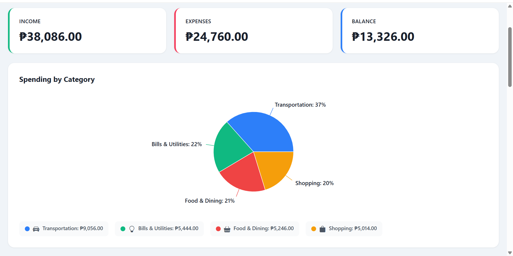
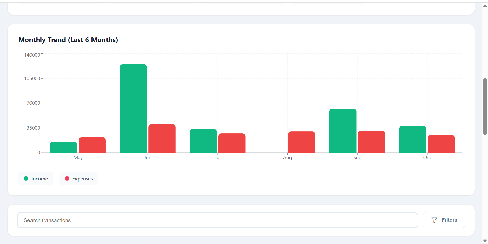

# Monivra - Personal Expense Tracker

A modern, intuitive expense tracking application built with React. Track your income and expenses, visualize spending patterns, and manage your finances with ease.

## Demo

### Screenshots

#### Analytics
Visualize your spending habits with detailed Pie and Bar charts for income and expenses over the past months.


#### Dashboard
Get an overview of your monthly balance, income, and expenses with quick summaries and filters for better tracking.


#### Add Transaction
Easily add new income or expense entries with categorized options, notes, and date selection.


### Live Demo
[View Demo](https://jericho066.github.io/monivra/)


## Features

- **Visual Analytics** - Pie charts for category breakdown and bar charts for monthly trends
- **Transaction Management** - Add, edit, and delete transactions with ease
- **Smart Filtering** - Search and filter by category, type, or keywords
- **Monthly Navigation** - Browse transactions by month
- **Data Backup** - Export/import your data in JSON or CSV format
- **Responsive Design** - Works seamlessly on desktop and mobile
- **Clean UI** - Simple, professional interface with Bootstrap Icons

##  Technologies Used

- **React** - Frontend framework
- **Recharts** - Data visualization
- **Bootstrap Icons** - Icon library
- **LocalStorage** - Data persistence
- **CSS3** - Modern styling


## Installation

### 1. Clone the repository
```bash
git clone https://github.com/jericho066/monivera.git
cd monivera
```

### 2. Install dependencies
```bash
npm install
```

### 3. Run in development mode
```bash
npm run dev

```

### 4. Open in browser:
```bash
http://localhost:5173/
```


